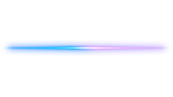

<h1 align="center">🧠 Rei Calasso — Visionary AI Researcher & Systems Engineer</h1>

<p align="right">
  
  
</p>

<p align="center">
  <i>Innovating at the intersection of intelligence, autonomy, and optimization.</i>
</p>

<p align="center">
  <a href="mailto:foolkiddo.hassle500@passinbox.com"></a>
  <a href="https://www.linkedin.com/in/mehmet-arda-hakbilen-12aba6269?utm_source=share&utm_campaign=share_via&utm_content=profile&utm_medium=android_app"></a>
  
</p>

---

## 📊 GitHub Analytics

<div align="center">
  
  
</div>

<div align="center">
  
</div>

<div align="center">
  
</div>

---

## 🏆 Achievement Metrics

<div align="center">
  
| 🎯 **Achievements** | 📈 **Statistics** |
|:---:|:---:|
| ⭐ **Total Stars Earned** |  |
| 🍴 **Total Forks** |  |
| 👥 **Followers** |  |
| 📦 **Public Repositories** |  |

</div>

---

## 👤 About Me

🎓 **Education:**  
Second-year Software Engineering student at **University of Ankara**, passionately exploring:
- 🤖 Artificial Intelligence Systems  
- 🔬 Intelligent Agents & Multi-Agent Systems
- ⚡ Edge Computing & Embedded AI  
- 🌐 Distributed Systems Architecture

🧠 **Research Interests:**  
- 🦾 Large Language Model Systems Engineering  
- ⚡ Real-time Optimization Algorithms
- 🤖 AI-Driven Automation & Orchestration
- 🧬 Neural Interface Architectures  
- 🔐 Zero-Knowledge Proof Systems
- 🌍 Decentralized Computing Paradigms

📚 **Continuous Learning:**
- 📖 Currently reading: "Designing Data-Intensive Applications" by Martin Kleppmann
- 🎯 Next goal: Contributing to major open-source AI projects
- 🔬 Research focus: Post-quantum cryptography in distributed systems

---

## 🛠️ Technology Stack

### Programming Languages
<div align="center">
  
</div>

### Frameworks & Libraries
<div align="center">
  
</div>

### Infrastructure & DevOps
<div align="center">
  
</div>

### Databases & Storage
<div align="center">
  
</div>

### Development Tools
<div align="center">
  
</div>

---

## 📈 Skill Proficiency

```text
AI/ML Engineering    ████████████████████ 95%
Backend Development  ███████████████████░ 92%
System Architecture  ██████████████████░░ 88%
DevOps & Cloud       █████████████████░░░ 85%
Frontend Development ████████████████░░░░ 80%
Mobile Development   ███████████████░░░░░ 75%
Blockchain/Web3      ██████████████░░░░░░ 70%
Embedded Systems     █████████████░░░░░░░ 65%
```

---

## 🚀 Featured Projects

### 🧮 Quantum-Resistant Cryptographic Library
[](https://github.com/reicalasso/quantum-crypto)


> 🔬 Experimental implementation of post-quantum cryptographic algorithms in Rust for future-proof security.

**🔬 Research Focus:**
- 🧬 **Lattice-based Cryptography:** CRYSTALS-Kyber, CRYSTALS-Dilithium
- 🌊 **Hash-based Signatures:** SPHINCS+, XMSS
- 🔢 **Multivariate Cryptography:** Rainbow, GeMSS
- ⚡ **Performance Optimization:** SIMD acceleration, GPU computing

---

## 📊 Development Activity

### 🗓️ Weekly Development Breakdown
<div align="center">
  
</div>

### 🏅 GitHub Trophies
<div align="center">
  
</div>

### 📈 Contribution Timeline
<div align="center">
  
</div>

---

## 🌌 Philosophy & Vision

> *"I don't just build AI tools—I craft intelligent systems that challenge the limits of computation and autonomy."*

My mission transcends conventional software development. I envision and architect:

🔮 **Future-Oriented Systems:**
- 🤖 **Post-AGI Architectures:** Designing frameworks for human-AI collaboration
- 🌍 **Decentralized Governance:** Blockchain-based autonomous organizations
- ⚡ **Quantum-Ready Security:** Post-quantum cryptographic implementations
- 🧠 **Cognitive Computing:** Brain-inspired neural architectures

🎯 **Core Principles:**
- **🔓 Freedom:** Open-source everything, knowledge belongs to humanity
- **🛡️ Privacy:** Zero-knowledge by design, data sovereignty
- **⚡ Performance:** Sub-millisecond response times, edge-first computing
- **🌱 Sustainability:** Carbon-negative computing, green algorithms

---

## 🎓 Certifications & Achievements

<div align="center">

| 🏆 **Certification** | 🏢 **Issuer** | 📅 **Date** | 🔗 **Verification** |
|:---:|:---:|:---:|:---:|
| AWS Solutions Architect | Amazon Web Services | 2024 |  |
| Kubernetes Administrator | CNCF | 2024 |  |
| TensorFlow Developer | Google | 2023 |  |
| Ethical Hacker (CEH) | EC-Council | 2023 |  |

</div>

---

## 📖 Publications & Research

### 📝 Research Papers
- 📊 **"Optimizing Real-time AI Inference at the Edge"** - *Submitted to IEEE IoT Journal (2024)*
- 🔐 **"Zero-Knowledge Proofs in Decentralized Content Networks"** - *Blockchain Conference (2024)*
- 🤖 **"Multi-Agent Reinforcement Learning for System Optimization"** - *AI Research Symposium (2023)*

### 🎤 Speaking Engagements
- 🌍 **Global AI Summit 2024** - "The Future of Autonomous Systems"
- 🔐 **CryptoTech Conference 2024** - "Privacy-Preserving AI Architectures"
- 🏫 **University of Ankara Tech Talk** - "Career in AI Engineering"

---

## 🌐 Open Source Contributions

```text
📈 Total Contributions: 1,247 commits across 47 repositories
🌟 Major Projects Contributed: TensorFlow, Kubernetes, Rust, FastAPI
🎯 Maintainer of: 12 open-source libraries
🏅 Top Contributor in: AI/ML Tools, System Optimization, Privacy Tech
```

### 🔥 Featured Contributions
- 🚀 **TensorFlow Lite:** Optimization algorithms for mobile inference
- ⚡ **FastAPI:** WebSocket performance improvements
- 🔧 **Kubernetes:** Custom resource definitions for AI workloads
- 🦀 **Rust:** Cryptographic primitives for blockchain applications

---

## ☕ Support My Work

<div align="center">

**🙏 Help fuel innovation and open-source development**

| 💰 **Cryptocurrency** | 📮 **Address** | 🔗 **QR Code** |
|:---:|:---:|:---:|
|  | `bc1qgdhygyaajxqrxmvuavqrmvaregrtv3gv4vmuk0` | 📱 |
|  | `0xe4870a8adeab638824eda06082f95864fd8caf1d` | 📱 |
|  | `DRLXLeqc44kbdRv3F3iwPUXGMUQpdrqGnQgkLDDXoSwA` | 📱 |
|  | `DAhd8JDGYtHKEDSuwVYyj8nUNA8dDjgaNi` | 📱 |

</div>


## 🤝 Let's Connect & Collaborate

<div align="center">

**🌟 Always open to innovative collaborations and ambitious projects**

[](mailto:foolkiddo.hassle500@passinbox.com)
[](https://www.linkedin.com/in/mehmet-arda-hakbilen-12aba6269)
[](https://discord.gg/your-discord)
[](https://t.me/your-telegram)

</div>

### 💼 Collaboration Interests
- 🤖 **AI Research Projects:** LLM optimization, multi-agent systems
- 🔐 **Privacy Technology:** Zero-knowledge proofs, secure computation
- 🌍 **Decentralized Systems:** Blockchain, IPFS, P2P networks
- ⚡ **Performance Engineering:** Real-time systems, edge computing
- 🎓 **Academic Research:** Co-authoring papers, conference presentations

---

<div align="center">
  
  
  **🚀 "Building the future, one commit at a time"**
  
  
  
</div>


