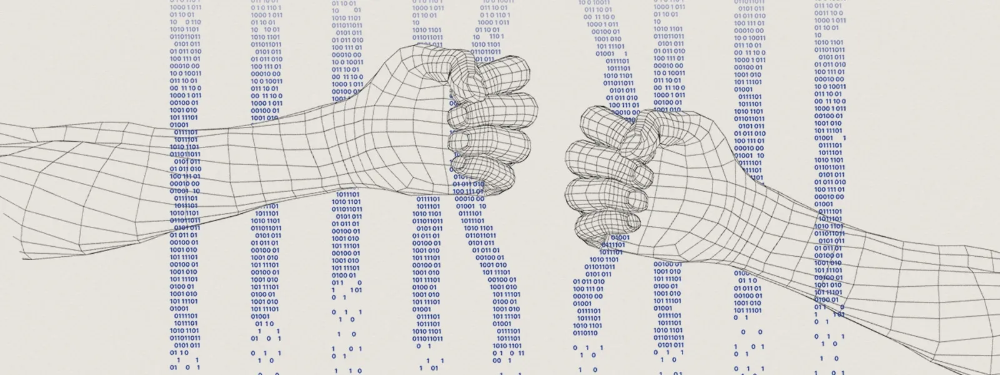

<p align="center">
  
</p>


<h1 align="center">🛡️ Yin Tsukuyomi — Cybersecurity Engineer</h1>

<p align="center">
  Passionate about ethical hacking, digital privacy, and building secure systems.
</p>

<p align="center">
  <a href="foolkiddo.hassle500@passinbox.com"></a>
  <a href="https://linkedin.com/in/mehmet-arda-hakbilen"></a>
</p>

---

## 👤 About Me

🎓 **Education:**  
Second-year Software Engineering student at **University of Ankara**, specializing in:
- Cybersecurity
- Ethical Hacking
- Digital Forensics

💻 **Skills:**  
- Penetration Testing  
- Threat Analysis  
- OSINT & Network Reconnaissance  
- Vulnerability Assessment  
- Secure Software Development

🔬 **Research Interests:**  
- AI-Driven Security  
- Reverse Engineering  
- Real-Time Threat Detection

---

## 🔥 Featured Project

### 🧹 Lucy : Digital Footprint Eraser  
> _"Because your data shouldn't haunt you."_

- A privacy-focused tool designed to **identify and remove** digital traces across the internet.
- Combines **OSINT techniques** with automated scripting to track down exposed data.
- Built for ethical use and personal privacy protection.

---

## 🚀 Currently Building

- 💣 Offensive security lab tools (Flooder, Brute-force tester, Deauth attacks)
- 🌐 Web-based threat simulators
- ⚙️ Embedded security with ESP32 (Sniffer/Deauth interface)
- 📂 Open-source intelligence platforms (CLI + GUI based)

---

## 🛠️ Tech Stack

```txt
🖥️ Languages: Python, C/C++/C#, Javascript, Bash, 
🔭 Platforms: Kali Linux, Parrot OS, HTB Labs, Windows
